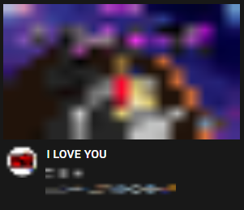

# PeaceKeeper_pc

## 개요
본 레포지토리는 졸업프로젝트로 사용 될 PeaceKeeper 라는 프로그램의 pc 버전입니다.  
이 버전은 현재 배포 방식에 대해 고민을 하던 결과 본 프로그램의 구성이 크롬 확장 프로그램 + 파이썬 서버 파일이기 때문에  
한번에 설치하기 위해선 설치파일을 별도로 또 개발해야 했습니다.  
물론 개발 할 수는 있었으나 이 프로젝트의 PC버전은 배포보다는 개발에 더 초점을 맞췄고 이 때문에 .exe 실행파일은 존재하지 않는다는 점 알려드립니다.  
* 다만 파이썬 설치가 되어있는 분은 실행하실 수 있습니다. (물론 모듈은 별도 설치 필요)

***

## Program 소개
> PeaceKeeper : 인공지능 기술을적용한 악성 문자열 필터링 어플리케이션

> 본 어플은 웹페이지에 접속하는 모든 텍스트를 긁어보아 악성 댓글을 포함한 악성 문자열들을 인공지능 기술을 이용해 다른 문자로 바꿔주는 어플리케이션입니다.  
> 악성 문자열로 판단되는 문자열은 모두 "I LOVE YOU"로 필터링됩니다. **(이용시 변경 가능합니다.)**  
> 이제 사람들은 당신에게 선플을 다는 사람들이 될 것입니다.  
> 악성 문자열을 글로 작성하는 것도 인터넷 자유의 권리입니다.  
> 그런 권리를 침해하지 않는 선에서 사용자가 악성 문자로 인해 멘탈이 흔들려지지 않도록 도와줍니다.  
> 기존에 나와있는 악성 문자열을 필터링해주는 기술들은 댓글 입력 부분에만 존재할 뿐더러, 아무리 인공지능을 사용해도 특정 사이트를 제외한 나머지 사이트는 적용되지 않았습니다.  
> 본 어플리케이션은 모든 사이트에 인공지능을 적용시켜주는 아주 고마운 어플리케이션입니다. :)  
> 이 어플리케이션을 통해 한사람 이상의 멘탈이 흔들리지 않았으면 좋겠고, 악성 문자열로 인해 생명을 잃는 일이 없었으면 좋겠습니다.  
> 이제 여러분도 악성 문자열에 흔들리지 마세요!  
>>  악성 문자열 : 악성 댓글을 포함한 기타 악의적으로 보이는 제목, 내용, 실시간 댓글 등 모든 것을 통칭하는 단어.

***

## PC 버전 (How to install?)
* 본 버전은 Python 설치 및 websockets, re, tensorflow 모듈 설치가 필요합니다.  
* Python에서 main.py을 실행하여 주십시오.  
* 크롬에서 옵션 - 도구 더보기 - 확장 프로그램으로 가셔서 우측 상단 개발자 모드 ON - 좌측 상단 "압축해제된 확장프로그램을 로드합니다" 클릭하여 Extension 폴더를 로드해주십시오.   
* 로드한 확장프로그램의 세부정보 - 확장프로그램 옵션 을 클릭하여 민감도 설정을 하고 Save 버튼을 눌러주십시오.  
* Python 콘솔에 Server Connect가 뜨면 정상적으로 연결이 된 것입니다. 이제 크롬에서 아무 사이트에 방문하시면 자동으로 필터링이 됩니다.  
* 만약 기다려도 연결이 되지 않는다면 옵션까지 설정 완료 후 확장프로그램을 껐다가 켜주십시오.

***

## 실행 이미지
  
<크롬 확장 프로그램>  
  
<크롬 확장 프로그램 옵션 설정>  
  
<크롬 확장 프로그램 옵션 설정 완료>  
  
<Python 서버 콘솔 화면>  
  
<필터링 화면>  
  
<크롬 창 우측 상단의 하히콘을 클릭했을때 나오는 필터링 된 문자들이 보이는 화면>  
